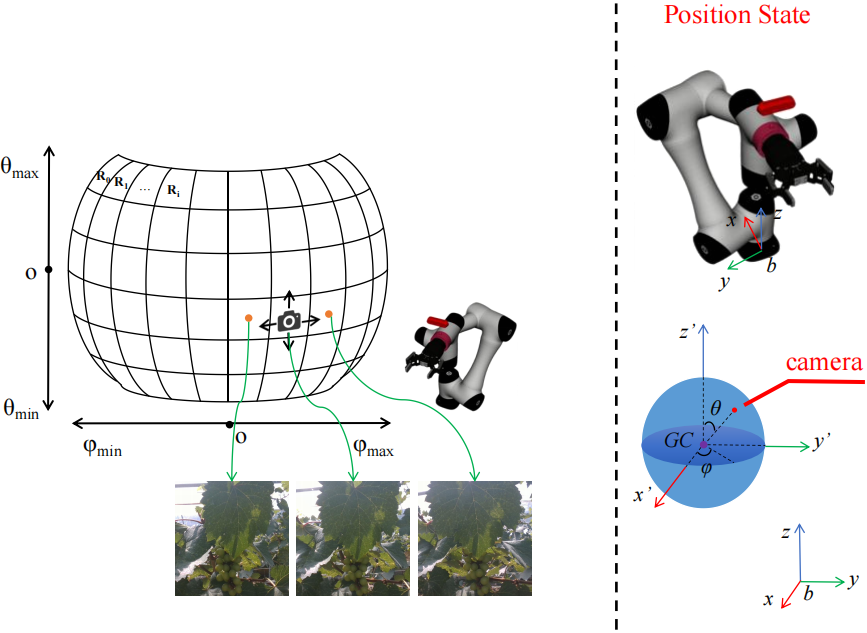

# MultiViewGrapeDataset
The target of the grape harvesting view planning task is to adjust the continuous camera viewpoints to ultimately help the robot locate the grape stem. 
This is a multi-view grape dataset designed for training a deep reinforcement learning policy network for this task. The dataset contains a total of 6 
groups of data. Each group includes RGB images, depth images captured from 147 sampled viewpoints, and a CSV file. 

As shown in Figure, during data collection, the camera viewpoints are constrained to lie on a spherical surface centered at the grape cluster centroid
$GC$ with a radius $R$. The camera position is represented as $p = [R, θ, φ]^T$. The center point of each region $R_{i}$ on the sphere is selected as a sampling 
point, and the robotic arm is controlled to move the camera to these points for data acquisition. The policy network outputs actions $A=\\{ +\Delta\theta, -\Delta\theta, +\Delta\phi, +\Delta\phi \\}$. 
By setting the size of each region $R_{i}$, the policy network ensures that each action results in the camera moving to an adjacent grid region.

The CSV file contains the following information:

1.Image name. Note that $rgb\\_n$ corresponds to the depth image $depth\\_n$

2.Camera position $p.φ$

3.Camera position $p.θ$

4.Viewpoint index after executing $+Δθ$ ($index = 200$ indicates the action cannot be performed)

5.Viewpoint index after executing $-Δθ$

6.Viewpoint index after executing $-Δφ$

7.Viewpoint index after executing $+Δφ$

8.Joint angles of the 6-DOF robotic arm $q = [q_{1}, q_{2}, q_{3}, q_{4}, q_{5}, q_{6}]$
