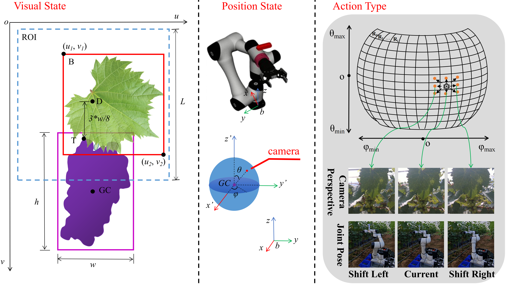

# MultiViewGrapeDataset
The target of the grape harvesting view planning task is to adjust the continuous camera viewpoints to ultimately help the robot locate the grape stem. 
To train the action classification model, multiple viewpoints of grape targets under different occlusion angles were sampled in real-world outdoor scenarios, resulting in a multi-view grape dataset. 
The dataset contains a total of 6 scens of data. Each scen includes RGB images, depth images captured from 147 sampled viewpoints, and a CSV file. 

As shown in Figure, during data collection, the camera viewpoints are constrained to lie on a spherical surface centered at the grape cluster centroid
$GC$ with a radius $R$. The camera position is represented as $p = [R, θ, φ]^T$. The center point of each region $R_{i}$ on the sphere is selected as a sampling 
point, and the robotic arm is controlled to move the camera to these points for data acquisition. The action types are represented by the action type list $AT = [at^{1}, at^{2}, ..., at^{N^{k}}]$. As illustrated in Fig. \ref{Fig_1}, 
eight specific action types are defined, namely $(0, +\Delta\theta)$, $(+\Delta\phi, +\Delta\theta)$, $(+\Delta\phi, 0)$,$(+\Delta\phi, -\Delta\theta)$, $(0, -\Delta\theta)$, $(-\Delta\phi, -\Delta\theta)$, $(-\Delta\phi, 0)$, 
$(-\Delta\phi, +\Delta\theta)$.

The CSV file contains the following information:

1.Image name. Note that $rgb\\_n$ corresponds to the depth image $depth\\_n$

2.Camera position $p.φ$

3.Camera position $p.θ$

4.Viewpoint index after executing $(0, +\Delta\theta)$ ($index = 200$ indicates the action cannot be performed)

5.Viewpoint index after executing $(+\Delta\phi, +\Delta\theta)$

6.Viewpoint index after executing $(+\Delta\phi, 0)$

7.Viewpoint index after executing $(+\Delta\phi, -\Delta\theta)$

8.Viewpoint index after executing $(0, -\Delta\theta)$

9.Viewpoint index after executing $(-\Delta\phi, -\Delta\theta)$

10.Viewpoint index after executing $(-\Delta\phi, 0)$

11.Viewpoint index after executing $(-\Delta\phi, +\Delta\theta)$

12.Joint angles of the 6-DOF robotic arm $q = [q_{1}, q_{2}, q_{3}, q_{4}, q_{5}, q_{6}]$
